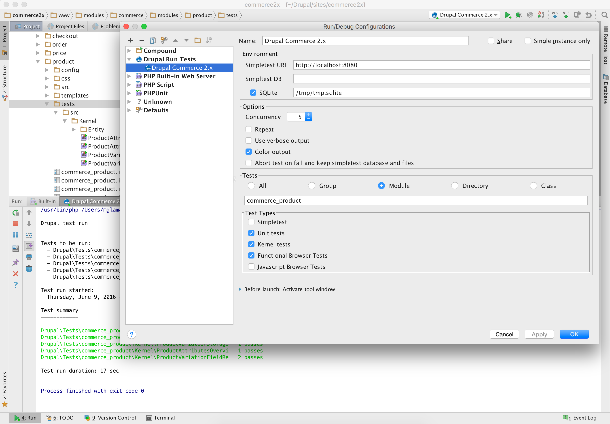

[Drupal Test Runner][home]
==================

by [Matt Glaman][glamanate]

With Drupal Test Runner, a new run configuration is added to PhpStorm specifically for Drupal's test running script
`run-tests.sh`. This allows you to run Simpletest, Unit, Kernel, Functional, and FunctionalJavascript tests with one
 single runner.

## Installing the plugin

Download the plugin from https://plugins.jetbrains.com/plugin/8384 or install through PhpStorm's plugin browser.

Alternatively, you can clone down the project and build it yourself.

## Using the plugin

* @todo document and screenshot the usage

## Contributing

See [Setting up an Environment](https://github.com/mglaman/intellij-drupal-run-tests/wiki/Setting-up-IntelliJ-IDEA-CE-for-development)

[home]: https://github.com/mglaman/intellij-drupal-run-tests
[glamanate]: https://glamanate.com
